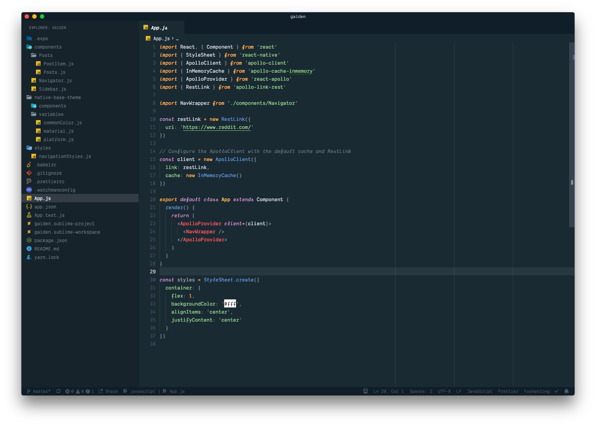

# Sceanic

> What if Spacegray meets Oceanic Next?

[**Sceanic**](https://tobiastimm.github.io/sceanic/) is a vscode theme combining the best parts of spacegray and oceanic next with some personal finishes. Heavily inspired by the great DA CS themes for sublime, I've ported my favorite to vscode.

See the [CHANGELOG](CHANGELOG.md) for the latest changes.

## Usage

Select the theme and you are ready to go!

## Installation

1.  Open Extensions sidebar panel in VS Code. View → Extensions
1.  Search for `Sceanic`
1.  Click Install
1.  Click Reload
1.  File > Preferences > Color Theme > Sceanic

## Recommended Settings

To enjoy the full oceanic expirience I recommend to install the [Material Theme](https://marketplace.visualstudio.com/items?itemName=Equinusocio.vsc-material-theme) and set the file icon theme to `Material Theme Icons Ocean`.

## Feedback / Issues

Do you like the theme? Don't hesitate to share your thoughts!

Let me know, if you'd like to see any specific synytax added by creating a [Github issue](https://github.com/tobiastimm/shuriken/issues).

## Author

[Tobias Timm](https://twitter.com/TbsTimm)

## License

MIT
